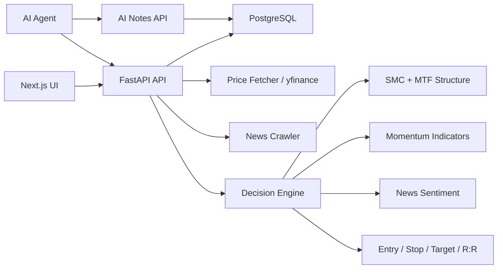

# Money Printer

AI-assisted stock research platform for cross-market screening, Smart Money Concepts (SMC) structure analysis, risk/reward planning, portfolio review, strategy signals, and AI-generated research notes.

> Research and engineering project only. This is not financial advice.

## Overview

Money Printer turns a discretionary trading workflow into a structured full-stack system. It tracks US and Taiwan equities, updates OHLCV data, evaluates market structure and momentum, generates entry/stop/target plans, and stores AI-written analysis notes for later review.

The project was built as an AI-assisted development case study: the implementation uses AI to accelerate frontend, backend, database, and workflow iteration, while the system design constrains AI output through explicit strategy rules, API contracts, and agent-facing instructions.

## What It Does

- **Cross-market scanner**: ranks US and Taiwan stocks by composite score, SMC trend, RSI, recommendation, and strategy signal.
- **SMC entry planning**: converts structure concepts such as Order Blocks, Fair Value Gaps, swing structure, and trend state into concrete entry / stop / target / R:R plans.
- **Layered decision engine**: combines SMC direction, momentum, news sentiment, risk/reward, and multi-timeframe alignment into a recommendation tier.
- **Portfolio review**: separates holdings from recommendations and supports post-entry risk review using latest prices and structure changes.
- **Strategy workflow**: supports multiple strategy profiles and signals rather than hardcoding one recommendation model.
- **AI notes loop**: allows an AI agent to read system data, generate Markdown analysis, and persist that analysis through API.

## Highlights

| Area | Implementation |
|---|---|
| Full-stack architecture | Next.js 16 frontend, FastAPI backend, PostgreSQL persistence |
| Async backend | SQLAlchemy 2.0 async + asyncpg |
| Market data | yfinance historical and latest price updates |
| Strategy logic | SMC + MTF structure, RSI, MACD, MA, volume, Bollinger Bands, sentiment |
| Risk controls | Entry, stop, target, R:R, position tier, no-long rule for weak structure |
| AI workflow | REST APIs, persisted AI analysis notes, agent-facing analysis workflow |
| Product surface | Dashboard, scanner, stock detail, briefing, portfolio, strategies |

## Screens

### Dashboard


Daily command center for latest analysis, tracked symbol count, market coverage, and top recommendations. The key product idea is that the system produces a shortlist after data refresh and analysis, rather than making the user inspect every ticker manually.

### Cross-Market Scanner


The scanner combines price, score, RSI, SMC trend, recommendation, action, entry plan, strategy signal, and AI note status in one table. This is the main decision surface for comparing candidates across US and Taiwan markets.

### Stock Detail


The stock detail page exposes the structured trade plan: recommendation, current price, SMC state, entry, stop, target, risk/reward, and position tier. This screen demonstrates how subjective chart-reading concepts are converted into inspectable software outputs.

### Briefing


The briefing view consolidates daily recommendations, portfolio alerts, latest analysis, and AI note context into a workflow-oriented checklist. It is designed as a pre-market review surface.

### Strategies


The strategies screen shows the backtesting and strategy-evaluation workflow. It is used to compare strategy profiles and signal quality before relying on them in the scanner and portfolio workflows.

## Architecture



## Tech Stack

| Layer | Stack |
|---|---|
| Frontend | Next.js 16, React 19, TypeScript, Tailwind CSS v4 |
| Backend | FastAPI, SQLAlchemy 2.0 async, asyncpg |
| Database | PostgreSQL 15 |
| Data source | yfinance, RSS news feeds |
| Analysis | SMC, MTF, RSI, MACD, moving averages, Bollinger Bands, volume, sentiment |
| Agent workflow | REST APIs, persisted AI notes, agent-facing analysis workflow |

## Decision Model

The recommendation model is intentionally layered so that a single strong indicator cannot override structural risk.

```text
Layer 0: Multi-timeframe structure
  Higher-timeframe conflict or triple weakness -> reject or downgrade

Layer 1: SMC direction gate
  Uptrend -> eligible
  Range -> downgraded
  Downtrend -> no long trade

Layer 2: Momentum confirmation
  MACD 30% + MA 25% + RSI 20% + Volume 15% + Bollinger Bands 10%

Layer 3: Catalyst
  Positive news -> conviction upgrade
  Neutral news -> no change
  Negative news -> warning or downgrade

Layer 4: Risk/reward
  R:R >= 2.0 required for high-quality setups

Layer 5: Position tier
  Core 15-20%, Standard 8-12%, Exploratory 3-5%
```

## AI-Assisted Engineering

This project is structured to demonstrate AI-assisted software development as an engineering process, not as one-shot code generation.

### How AI Was Used

- Generated and iterated FastAPI routers, SQLAlchemy models, Next.js pages, reusable components, and TypeScript API clients.
- Helped convert repeated analysis workflows into an agent-facing API workflow.
- Assisted debugging frontend state issues, stale data states, and API integration problems, while product boundaries and strategy constraints were defined through engineering design.

### Human Engineering Controls

- Product boundaries were defined before implementation: scanner, analysis engine, portfolio, strategies, and AI notes are separate modules.
- Trading rules were decomposed into deterministic layers instead of relying on opaque AI-generated scoring.
- The agent workflow defines how an AI agent should read market context, produce recommendations, and write analysis notes back to the system.
- API contracts keep AI-generated analysis grounded in stored system data rather than free-form chat output.

### Engineering Decisions

- **AI-generated scoring needed guardrails**: added structure-first rules such as no long trades in weak/down structures, no chasing extended prices, and R:R-based downgrades.
- **Frontend hydration mismatch**: fixed auth initialization so server and client render paths no longer disagree on initial auth state.
- **React effect loop**: stabilized strategy signal dependencies to prevent repeated fetch/setState loops in dashboard tables.
- **Data freshness gap**: verified price freshness separately from analysis freshness so updated prices do not silently coexist with stale analysis.
- **Portfolio vs recommendation separation**: kept holdings independent from daily recommendations so the system can answer both candidate-selection and position-management questions.

## Agent-Facing API

AI agents can consume the same system context as the UI and persist analysis notes back into the product.

| Endpoint | Method | Purpose |
|---|---:|---|
| `/api/v1/analysis/latest` | GET | Latest full analysis result |
| `/api/v1/analysis/top-picks` | GET | Ranked recommendations |
| `/api/v1/stocks/latest-prices` | GET | Latest stored prices and freshness metadata |
| `/api/v1/stocks/smc-trends` | GET | SMC / MTF trend map |
| `/api/v1/portfolio` | GET | Current holdings |
| `/api/v1/briefing/next-open` | GET | Pre-market briefing context |
| `/api/v1/ai-notes` | POST | Persist AI-written Markdown analysis |
| `/api/v1/ai-notes/latest` | GET | Latest AI note by ticker |

Example persisted AI note:

```json
{
  "ticker": "NVDA",
  "analysis_type": "individual",
  "recommendation": "watch",
  "action": "wait_for_pullback",
  "summary": "## NVDA Analysis\nStructure remains constructive, but the preferred setup requires a pullback into the entry zone.",
  "price_at_analysis": 198.45,
  "composite_score": 69,
  "smc_trend": "ranging",
  "entry_price": 188.0,
  "stop_price": 180.0,
  "target_price": 208.0,
  "rr_ratio": 2.5,
  "scenarios": {
    "base": {
      "condition": "Pullback holds above structural support",
      "action": "Exploratory position"
    },
    "risk": {
      "condition": "Break below structural stop",
      "action": "No trade"
    }
  }
}
```

## Local Development

Prerequisites:

- Python 3.11
- Conda environment named `money_printer`
- Node.js 20+
- PostgreSQL 15

Backend:

```bash
conda activate money_printer
python main.py --no-reload
```

Frontend:

```bash
cd frontend
npm run dev
```

URLs:

- Frontend: `http://localhost:3000`
- Backend: `http://localhost:8000`
- API docs: `http://localhost:8000/docs`

## Data Refresh

```bash
# Update recent price history
curl -X POST "http://localhost:8000/api/v1/stocks/batch-fetch?days=21"

# Run analysis
curl -X POST "http://localhost:8000/api/v1/analysis/run?news_days=3"

# Read latest analysis
curl http://localhost:8000/api/v1/analysis/latest
```

Demo dataset:

- Tracks 68 US and Taiwan equities.
- Supports daily price refresh and analysis updates.
- Screenshots are representative demo captures, not investment recommendations.
