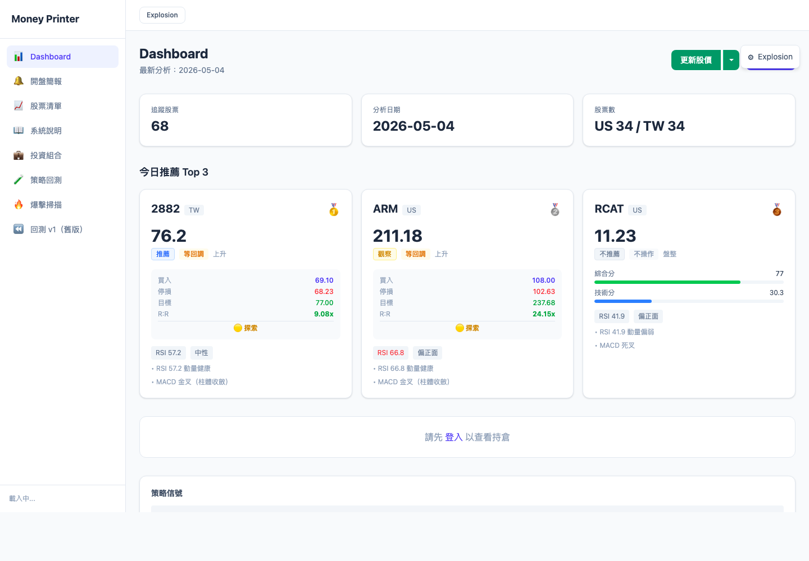
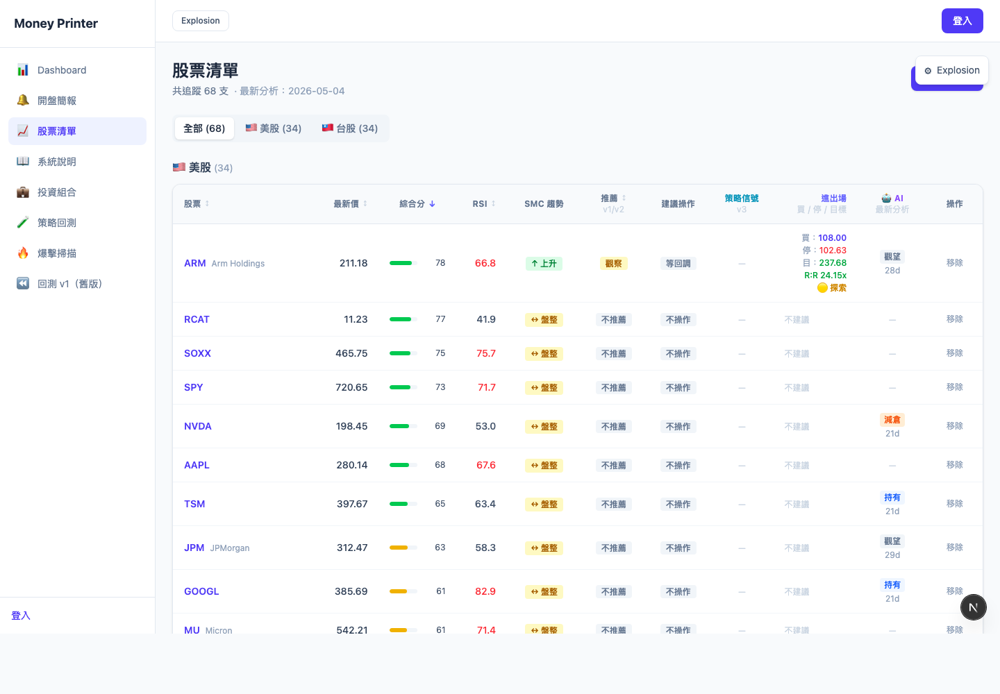
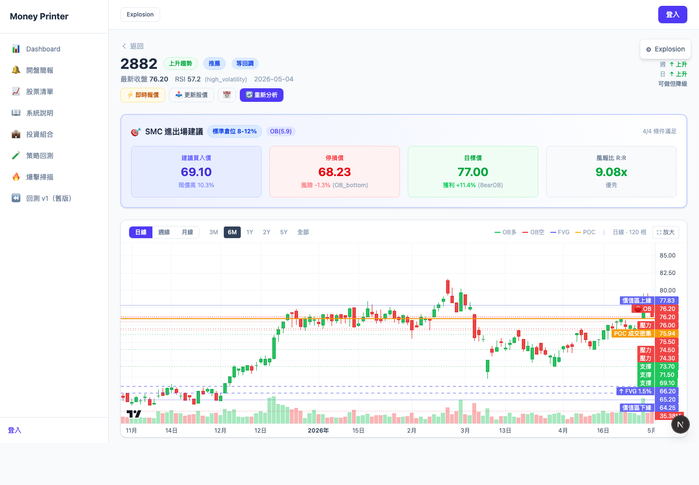
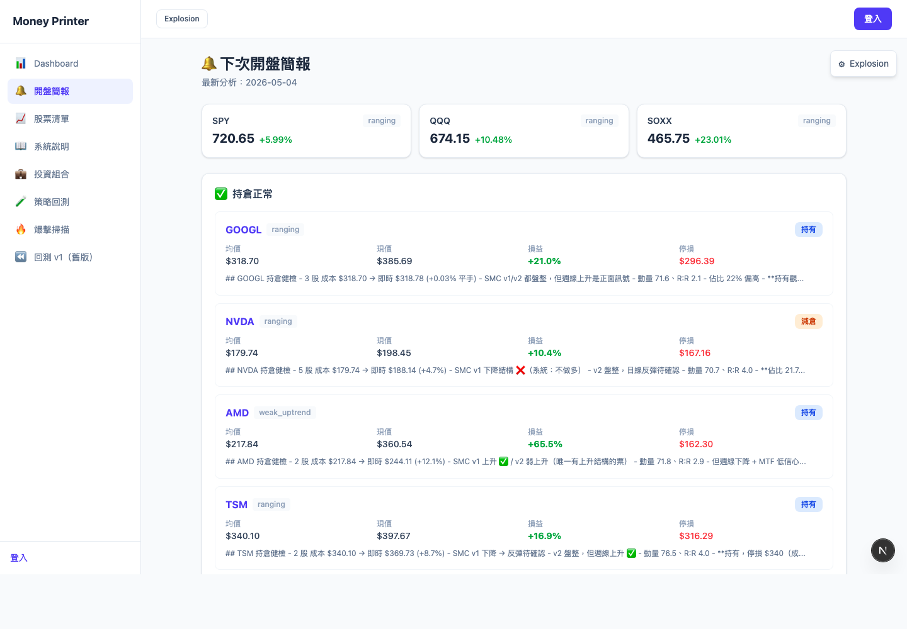
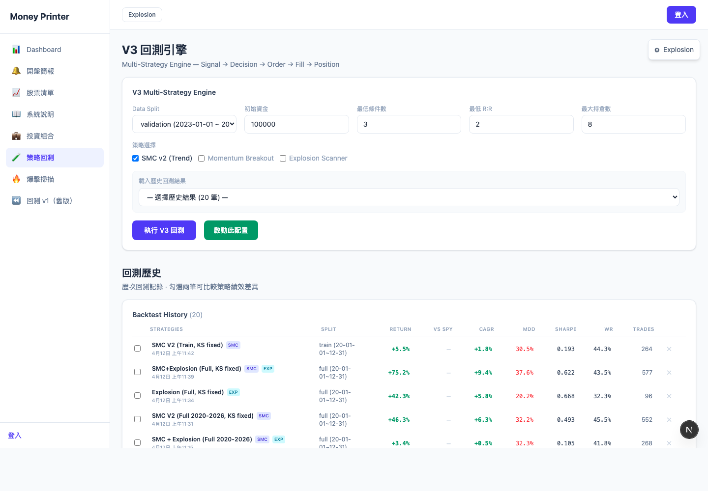
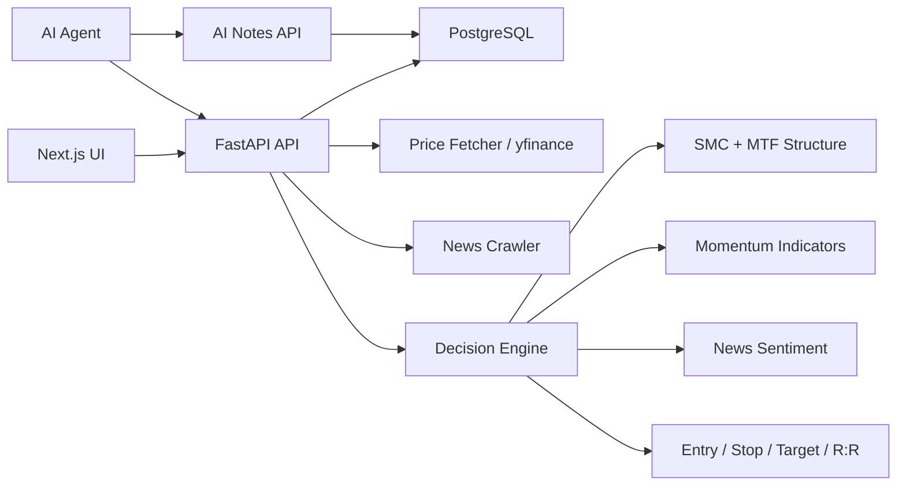

# Money Printer

[English version](README.en.md)

美股 / 台股股票研究平台，整合 SMC 結構分析、動量確認、風報比規劃、投資組合健檢、策略信號與 AI 分析筆記。

> 工程與交易研究專案，不構成投資建議。

## 專案概述

Money Printer 把原本偏人工判斷的交易研究流程，整理成一套可執行、可追蹤、可被 AI agent 使用的 full-stack 系統。系統會更新股價資料、分析市場結構與動量，產生 entry / stop / target / R:R，並允許 AI 將分析結論寫回資料庫形成歷史紀錄。

這個專案的重點不是單一 dashboard，而是完整資料流：

```text
股價 / 新聞資料 -> 分析引擎 -> 推薦與風控計畫 -> 前端決策介面 -> AI notes 寫回
```

## 核心能力

- **跨市場掃描**：同時追蹤美股與台股，依綜合分、SMC 趨勢、RSI、推薦等級與策略信號排序。
- **SMC 進出場計畫**：將 Order Block、FVG、swing structure、趨勢狀態轉成 entry / stop / target / R:R。
- **分層決策引擎**：結合 SMC 方向、動量、新聞情緒、風報比與多時間框架，輸出推薦等級與倉位層級。
- **投資組合健檢**：將持倉與每日推薦分開建模，用最新價與結構變化做 post-entry risk review。
- **多策略信號**：支援 SMC v2、Explosion、Momentum 等策略 profile，而不是把邏輯寫死在 UI。
- **AI 分析閉環**：AI agent 可讀取系統 API、產生 Markdown 分析，並透過 `ai-notes` API 寫回系統。

## 技術亮點

| 領域 | 實作 |
|---|---|
| Full-stack | Next.js 16, React 19, FastAPI, PostgreSQL |
| Async backend | SQLAlchemy 2.0 async, asyncpg |
| Market data | yfinance 歷史股價與最新價格更新 |
| Strategy logic | SMC, MTF, RSI, MACD, MA, volume, Bollinger Bands, sentiment |
| Risk controls | Entry, stop, target, R:R, position tier, no-long rule |
| AI workflow | REST APIs, persisted AI analysis notes, agent-facing analysis workflow |
| Product surface | Dashboard, scanner, stock detail, briefing, portfolio, strategies |

## 產品畫面

### Dashboard



每日分析入口，顯示最新分析日期、追蹤股票數、市場覆蓋範圍與 Top recommendations。使用者不需要逐檔打開股票，系統會在資料更新後自動整理候選名單。

### Cross-Market Scanner



股票掃描頁整合最新價、綜合分、RSI、SMC 趨勢、推薦等級、建議操作、進出場計畫、策略信號與 AI note 狀態，是主要的比較與篩選介面。

### Stock Detail



個股頁展示結構化交易計畫：SMC 狀態、買入價、停損價、目標價、風報比與倉位等級。這頁呈現的是「主觀看圖策略如何被工程化」。

### Briefing



開盤簡報整合推薦標的、持倉警報、最新分析與 AI note context，定位是盤前 workflow surface，而不是靜態資訊頁。

### Strategies



策略頁展示回測與策略評估流程，用來比較不同策略 profile 的結果與信號品質。這讓推薦邏輯可以被驗證，而不是只停留在即時掃描結果。

## 系統架構



## 分層決策模型

```text
Layer 0: Multi-timeframe structure
  高時間框架衝突 / 三重弱勢 -> 排除或降級

Layer 1: SMC direction gate
  上升 -> 可交易
  盤整 -> 降級
  下降 -> 不做多

Layer 2: Momentum confirmation
  MACD 30% + MA 25% + RSI 20% + Volume 15% + Bollinger Bands 10%

Layer 3: Catalyst
  正面新聞 -> 信心升級
  中性新聞 -> 不影響
  負面新聞 -> 警告或降級

Layer 4: Risk/reward
  R:R >= 2.0 才視為高品質 setup

Layer 5: Position tier
  核心 15-20%, 標準 8-12%, 探索 3-5%
```

## AI-Assisted Engineering

這個專案展示的是 AI-assisted software development 的工程流程，而不是一次性 code generation。

### AI 的使用方式

- 生成與迭代 FastAPI routers、SQLAlchemy models、Next.js pages、React components、TypeScript API client。
- 將重複分析流程整理成可被 AI agent 執行的 API workflow。
- 協助定位 frontend state、資料 freshness、API integration 等問題，但策略規則與系統邊界由工程設計約束。

### 工程約束

- 先拆清楚 product boundary：scanner、analysis engine、portfolio、strategies、AI notes 各自獨立。
- 交易規則被拆成 deterministic layers，避免依賴 AI 生成的不透明分數。
- Agent workflow 定義 AI 如何讀取市場 context、產生推薦、寫回分析筆記。
- API contract 讓 AI 分析基於系統資料，而不是只停留在聊天輸出。

### Engineering Decisions

- **AI scoring guardrails**：加入結構優先規則，例如弱/下降結構不做多、不追高、R:R 不足降級。
- **Hydration mismatch**：修正 auth 初始化，避免 server/client 初始 render 不一致。
- **React effect loop**：穩定策略信號 dependencies，避免 dashboard 重複 fetch / setState。
- **Data freshness**：分開檢查 price freshness 與 analysis freshness，避免價格已更新但分析仍過期。
- **Portfolio separation**：持倉與每日推薦分開建模，讓系統能同時回答「買什麼」與「持倉怎麼處理」。

## AI Agent API

| Endpoint | Method | Purpose |
|---|---:|---|
| `/api/v1/analysis/latest` | GET | 最新完整分析結果 |
| `/api/v1/analysis/top-picks` | GET | 推薦排序 |
| `/api/v1/stocks/latest-prices` | GET | 最新價格與 freshness metadata |
| `/api/v1/stocks/smc-trends` | GET | SMC / MTF 趨勢 |
| `/api/v1/portfolio` | GET | 目前持倉 |
| `/api/v1/briefing/next-open` | GET | 盤前簡報 context |
| `/api/v1/ai-notes` | POST | 寫入 AI Markdown 分析 |
| `/api/v1/ai-notes/latest` | GET | 每支股票最新 AI note |

## Local Development

Backend:

```bash
conda activate money_printer
python main.py --no-reload
```

Frontend:

```bash
cd frontend
npm run dev
```

URLs:

- Frontend: `http://localhost:3000`
- Backend: `http://localhost:8000`
- API docs: `http://localhost:8000/docs`

## Data Refresh

```bash
curl -X POST "http://localhost:8000/api/v1/stocks/batch-fetch?days=21"
curl -X POST "http://localhost:8000/api/v1/analysis/run?news_days=3"
curl http://localhost:8000/api/v1/analysis/latest
```

Demo dataset:

- Tracks 68 US and Taiwan equities.
- Supports daily price refresh and analysis updates.
- Screenshots are representative demo captures, not investment recommendations.
